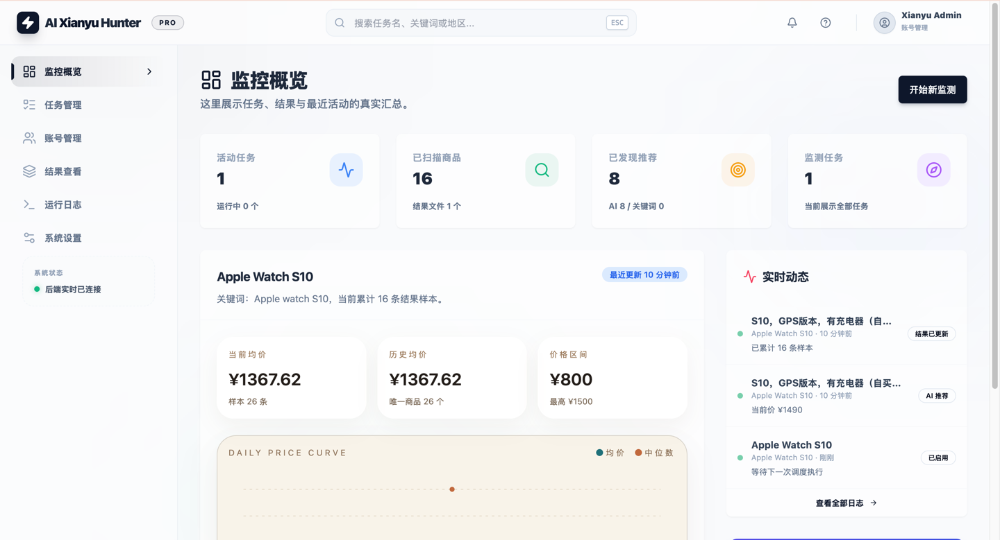
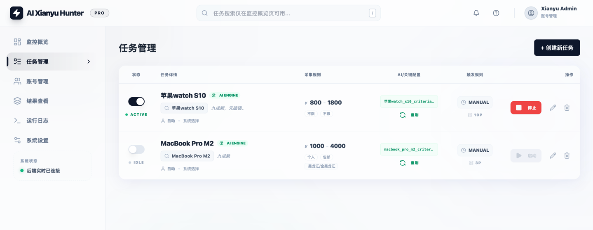
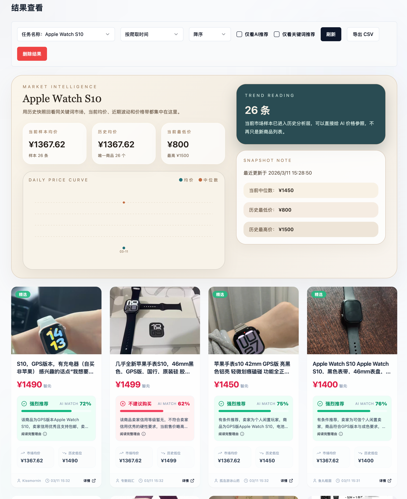
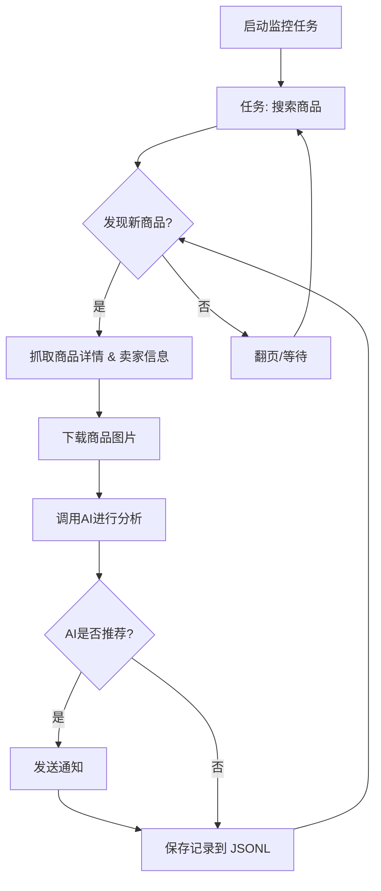

# 闲鱼智能监控机器人

基于 Playwright 和 AI 的闲鱼多任务实时监控工具，提供完整的 Web 管理界面。

## 核心特性

- **Web 可视化管理**: 任务管理、AI 标准编辑、实时日志、结果浏览
- **AI 驱动**: 自然语言创建任务，多模态模型深度分析商品
- **多任务并发**: 独立配置关键词、价格、筛选条件和 AI Prompt
- **即时通知**: 支持 ntfy.sh、企业微信、Bark、Telegram、Webhook
- **定时调度**: Cron 表达式配置周期性任务
- **Docker 部署**: 一键容器化部署

## 截图





## 快速开始

### 环境准备

**要求**: Python 3.10+ Vue3

```bash
git clone https://github.com/Usagi-org/ai-goofish-monitor
cd ai-goofish-monitor
pip install -r requirements.txt
playwright install chromium
```

### 配置

1. **创建配置文件**

```bash
cp .env.example .env
```

2. **核心配置项**

| 变量 | 说明 | 必填 |
|------|------|------|
| `OPENAI_API_KEY` | AI 模型 API Key | 是 |
| `OPENAI_BASE_URL` | API 接口地址（兼容 OpenAI 格式） | 是 |
| `OPENAI_MODEL_NAME` | 多模态模型名称（如 `gpt-4o`） | 是 |
| `WEB_USERNAME` / `WEB_PASSWORD` | Web 界面登录凭据（默认 `admin` / `admin123`） | 否 |
| `NTFY_TOPIC_URL` | ntfy.sh 通知地址 | 否 |
| `BARK_URL` | Bark 推送地址 | 否 |
| `WX_BOT_URL` | 企业微信 Webhook（需用双引号包围） | 否 |

完整配置项参考 `.env.example`

3. **获取登录状态**

启动服务后，访问 Web UI → **登录页面** → **右上角-手动更新登录状态**，按提示使用 [Chrome 扩展](https://chromewebstore.google.com/detail/xianyu-login-state-extrac/eidlpfjiodpigmfcahkmlenhppfklcoa) 提取闲鱼Cookie。

### 启动服务

```bash
chmod +x start.sh && ./start.sh
```

访问 `http://127.0.0.1:8000`，创建监控任务即可开始使用。

## 🐳 Docker 部署 (推荐)

使用 Docker 可以将应用及其所有依赖项打包到一个标准化的单元中，实现快速、可靠和一致的部署。

### 第 1 步: 环境准备 (与本地部署类似)

1. **安装 Docker**: 请确保你的系统已安装 [Docker Engine](https://docs.docker.com/engine/install/)。

2. **克隆项目并配置**:

    ```bash
    git clone https://github.com/Usagi-org/ai-goofish-monitor
    cd ai-goofish-monitor
    ```

3. **创建 `.env` 文件**: 参考 **[快速开始](#快速开始)** 部分的说明，在项目根目录创建并填写 `.env` 文件。

4. **获取登录状态 (关键步骤!)**: Docker容器内无法进行扫码登录。请在**启动容器后**，通过访问Web UI来设置登录状态：
    1. （在宿主机上）执行 `docker-compose up -d` 启动服务。
    2. 在浏览器中打开 `http://127.0.0.1:8000` 访问Web UI。
    3. 进入 **"系统设置"** 页面，点击 **"手动更新"** 按钮。
    4. 按照弹窗内的指引操作：
       - 在您的个人电脑上，使用Chrome浏览器安装[闲鱼登录状态提取扩展](https://chromewebstore.google.com/detail/xianyu-login-state-extrac/eidlpfjiodpigmfcahkmlenhppfklcoa)
       - 打开并登录闲鱼官网
       - 登录成功后，点击浏览器工具栏中的扩展图标
       - 点击"提取登录状态"按钮获取登录信息
       - 点击"复制到剪贴板"按钮
       - 将复制的内容粘贴到Web UI中保存即可

> ℹ️ **关于Python版本**: 使用Docker部署时，项目使用的是Dockerfile中指定的Python 3.11版本，无需担心本地Python版本兼容性问题。

### 第 2 步: 运行 Docker 容器

项目已包含 `docker-compose.yaml` 文件，我们推荐使用 `docker-compose` 来管理容器，这比使用 `docker run` 更方便。

在项目根目录下，运行以下命令来启动容器：

```bash
docker-compose up --build -d
```

这会以后台模式启动服务。`docker-compose` 会自动读取 `.env` 文件和 `docker-compose.yaml` 的配置，并根据其内容来创建和启动容器。

如果容器内遇到网络问题，请自行排查或使用代理。

> ⚠️ **OpenWrt 环境部署注意事项**: 如果您在 OpenWrt 路由器上部署此应用，可能会遇到 DNS 解析问题。这是因为 Docker Compose 创建的默认网络可能无法正确继承 OpenWrt 的 DNS 设置。如果遇到 `ERR_CONNECTION_REFUSED` 错误，请检查您的容器网络配置，可能需要手动配置 DNS 或调整网络模式以确保容器可以正常访问外部网络。

### 第 3 步: 访问和管理

- **访问 Web UI**: 在浏览器中打开 `http://127.0.0.1:8000`。
- **查看实时日志**: `docker-compose logs -f`
- **停止容器**: `docker-compose stop`
- **启动已停止的容器**: `docker-compose start`
- **停止并移除容器**: `docker-compose down`

## Web UI 功能一览

<details>
<summary>点击展开 Web UI 功能详情</summary>

- **任务管理**:
  - **AI创建任务**: 使用自然语言描述需求，一键生成监控任务和配套AI分析标准。
  - **可视化编辑与控制**: 在表格中直接修改任务参数（如关键词、价格、定时规则等），并能独立启/停、删除每个任务。
  - **定时调度**: 为任务配置 Cron 表达式，实现自动化周期性运行。
- **结果查看**:
  - **卡片式浏览**: 以图文卡片形式清晰展示每个符合条件的商品。
  - **智能筛选与排序**: 可一键筛选出所有被AI标记为"推荐"的商品，并支持按爬取时间、发布时间、价格等多种方式排序。
  - **深度详情**: 点击即可查看每个商品的完整抓取数据和AI分析的详细JSON结果。
- **运行日志**:
  - **实时日志流**: 在网页上实时查看爬虫运行的详细日志，方便追踪进度和排查问题。
  - **日志管理**: 支持自动刷新、手动刷新和一键清空日志。
- **系统设置**:
  - **状态检查**: 一键检查 `.env` 配置、登录状态等关键依赖是否正常。
  - **Prompt在线编辑**: 直接在网页上编辑和保存用于AI分析的 `prompt` 文件，实时调整AI的思考逻辑。

</details>

## 🚀 工作流程

下图描述了单个监控任务从启动到完成的核心处理逻辑。在实际使用中，`web_server.py` 会作为主服务，根据用户操作或定时调度来启动一个或多个这样的任务进程。



## Web界面认证

<details>
<summary>点击展开认证配置详情</summary>

### 认证配置

Web界面已启用Basic认证保护，确保只有授权用户才能访问管理界面和API。

#### 配置方法

在 `.env` 文件中设置认证凭据：

```bash
# Web服务认证配置
WEB_USERNAME=admin
WEB_PASSWORD=admin123
```

#### 默认凭据

如果未在 `.env` 文件中设置认证凭据，系统将使用以下默认值：
- 用户名：`admin`
- 密码：`admin123`

**⚠️ 重要：生产环境请务必修改默认密码！**

#### 认证范围

- **需要认证**：所有API端点、Web界面、静态资源
- **无需认证**：健康检查端点 (`/health`)

#### 使用方法

1. **浏览器访问**：访问Web界面时会弹出认证对话框
2. **API调用**：需要在请求头中包含Basic认证信息
3. **前端JavaScript**：会自动处理认证，无需修改

#### 安全建议

1. 修改默认密码为强密码
2. 生产环境使用HTTPS协议
3. 定期更换认证凭据
4. 通过防火墙限制访问IP范围

详细配置说明请参考 [AUTH_README.md](AUTH_README.md)。

</details>


## 致谢

<details>
<summary>点击展开致谢内容</summary>

本项目在开发过程中参考了以下优秀项目，特此感谢：

- [superboyyy/xianyu_spider](https://github.com/superboyyy/xianyu_spider)

以及感谢LinuxDo相关人员的脚本贡献

- [@jooooody](https://linux.do/u/jooooody/summary)

以及感谢 [LinuxDo](https://linux.do/) 社区。

以及感谢 ClaudeCode/Gemini 等模型/工具，解放双手 体验Vibe Coding的快乐。

</details>

## 体会

<details>
<summary>点击展开项目体会</summary>

本项目 90%+ 的代码都由AI生成，包括 ISSUE 中涉及的 PR 。

Vibe Coding 的可怕之处在于如果不过多的参与项目建设，对AI生成的代码没有进行细致的review，没有思考过AI为什么这么写，盲目的通过跑测试用例验证功能可用性只会导致项目变成一个黑盒。

同样再用AI对AI生成的代码进行code review时，就像是用AI来验证另一个AI的回答是不是AI，陷入了自我证明的困境之中，所以AI可以辅助分析，但不应该成为真相的仲裁者。


</details>

## 注意事项

<details>
<summary>点击展开注意事项详情</summary>

- 请遵守闲鱼的用户协议和robots.txt规则，不要进行过于频繁的请求，以免对服务器造成负担或导致账号被限制。
- 本项目仅供学习和技术研究使用，请勿用于非法用途。
- 本项目采用 [MIT 许可证](LICENSE) 发布，按"现状"提供，不提供任何形式的担保。
- 项目作者及贡献者不对因使用本软件而导致的任何直接、间接、附带或特殊的损害或损失承担责任。
- 如需了解更多详细信息，请查看 [免责声明](DISCLAIMER.md) 文件。

</details>

## Star History

[](https://www.star-history.com/#Usagi-org/ai-goofish-monitor&Date)
