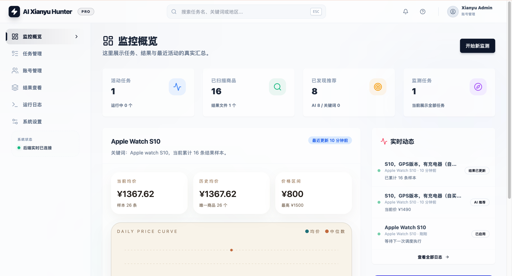
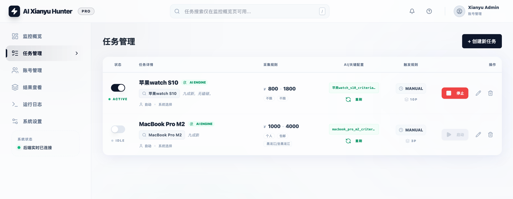
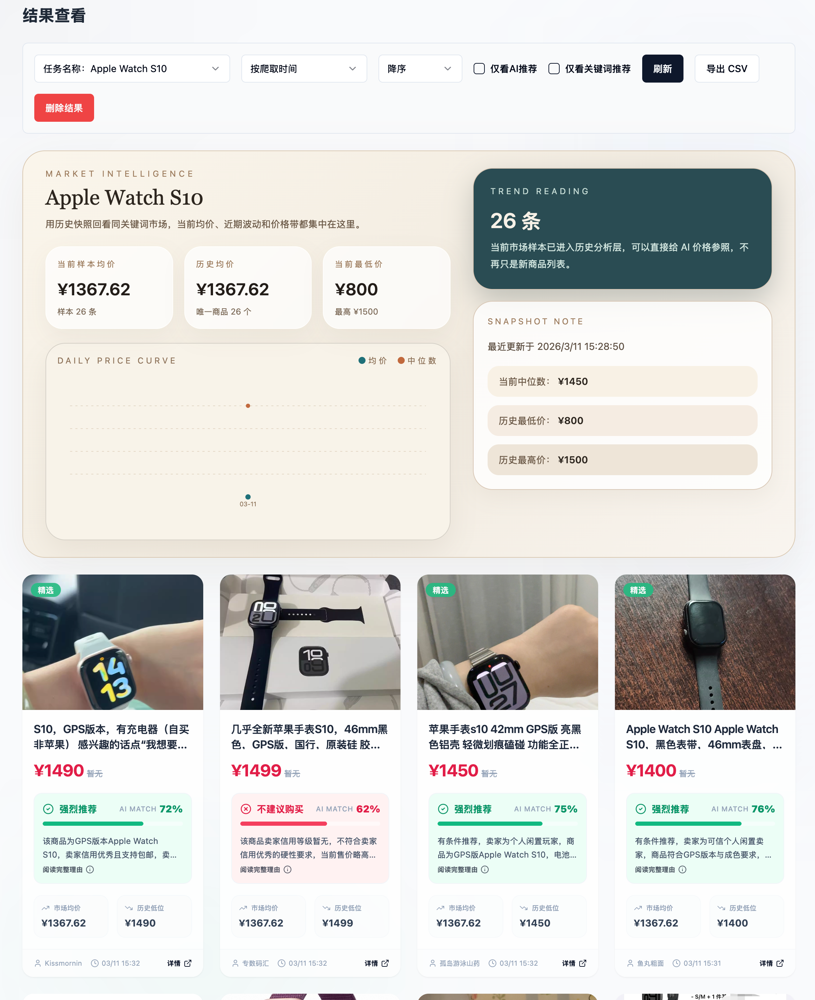
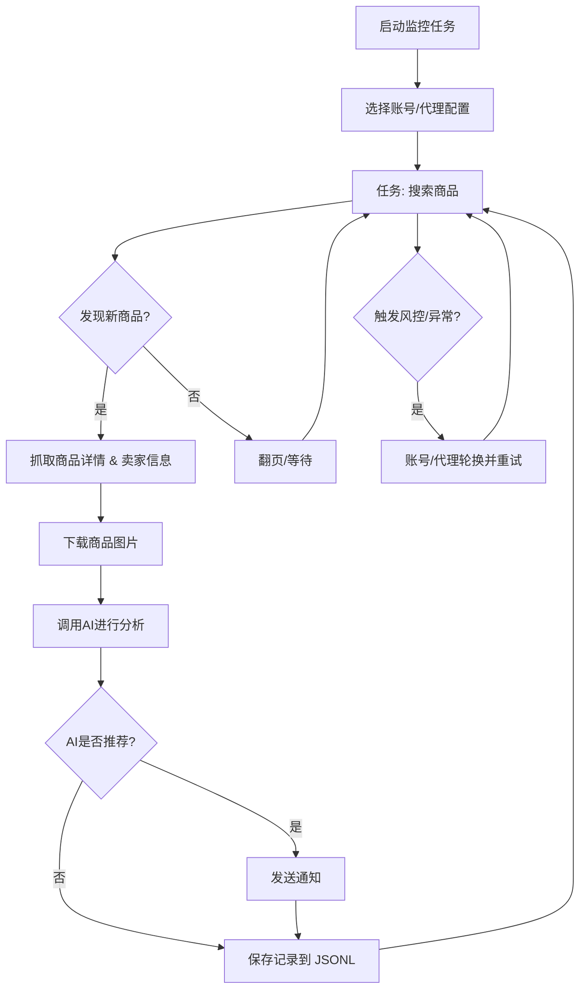

# 闲鱼智能监控机器人

[English README](README_EN.md)

基于 Playwright 和 AI 的闲鱼多任务实时监控工具，提供完整的 Web 管理界面。

## 核心特性

- **Web 可视化管理**: 任务管理、账号管理、AI 标准编辑、运行日志、结果浏览
- **AI 驱动**: 自然语言创建任务，多模态模型深度分析商品
- **多任务并发**: 独立配置关键词、价格、筛选条件和 AI Prompt
- **高级筛选**: 包邮、新发布时间范围、省/市/区三级区域筛选
- **即时通知**: 支持 ntfy.sh、企业微信、Bark、Telegram、Webhook
- **定时调度**: Cron 表达式配置周期性任务
- **账号与代理轮换**: 多账号管理、任务绑定账号、代理池轮换与失败重试
- **Docker 部署**: 一键容器化部署

## 截图





## 快速开始

### 环境要求

- Python 3.10+
- Node.js + npm（本地验证 `Node v20.18.3` 可完成前端构建）
- Playwright 及 Chromium 依赖

```bash
git clone https://github.com/Usagi-org/ai-goofish-monitor
cd ai-goofish-monitor
cp .env.example .env
```

### 最少配置

| 变量 | 说明 | 必填 |
|------|------|------|
| `OPENAI_API_KEY` | AI 模型 API Key | 是 |
| `OPENAI_BASE_URL` | OpenAI 兼容接口地址 | 是 |
| `OPENAI_MODEL_NAME` | 支持图片输入的模型名称 | 是 |
| `WEB_USERNAME` / `WEB_PASSWORD` | Web UI 登录账号密码，默认 `admin/admin123` | 否 |

其余配置见下方“配置说明”。

### 本地启动

```bash
chmod +x start.sh
./start.sh
```

`start.sh` 会自动完成环境检查、依赖安装、前端构建、构建产物复制和后端启动。

### 第一次使用

1. 打开 `http://127.0.0.1:8000`，使用 Web UI 账号登录。
2. 进入“闲鱼账号管理”，使用 [Chrome 扩展](https://chromewebstore.google.com/detail/xianyu-login-state-extrac/eidlpfjiodpigmfcahkmlenhppfklcoa) 导出并粘贴闲鱼登录态 JSON。
3. 登录态文件会保存到 `state/` 目录，例如 `state/acc_1.json`。
4. 回到“任务管理”，创建任务并绑定账号后即可运行。

### 创建第一个任务

- `AI判断`：填写“详细需求”，提交后会弹出独立进度弹窗，后台异步生成分析标准。
- `关键词判断`：填写关键词规则，任务会直接创建，不经过 AI 生成流程。
- `区域筛选`：已改为省 / 市 / 区三级选择器，数据基于闲鱼页面抓取快照内置，不再要求手动输入。

## 🐳 Docker 部署

```bash
docker compose up -d
docker compose logs -f app
docker compose down
```

- Web UI 地址：`http://127.0.0.1:8000`
- 更新镜像：`docker compose pull && docker compose up -d`
- `docker-compose.yaml` 默认已挂载并持久化以下数据：
  - `state/`
  - `config.json`
  - `prompts/`
  - `jsonl/`
  - `logs/`
  - `images/`

## 用户使用说明

<details>
<summary>点击展开 Web UI 功能说明</summary>

### 任务管理

- 支持 AI 创建、关键词规则、价格范围、新发布范围、区域筛选、账号绑定、定时规则。
- AI 任务创建是后台 job 流程，提交后会打开单独的进度弹窗。
- 区域筛选会显著缩小结果集，默认留空更稳妥。

### 账号管理

- 支持导入、更新、删除闲鱼账号登录态。
- 每个任务可指定账号，也可不绑定并交给系统自动选择。

### 结果查看与运行日志

- 结果页用于浏览命中的商品卡片与详情。
- 日志页按任务展示运行过程，便于排查登录态失效、风控和 AI 调用问题。

### 系统设置

- 可查看系统状态、编辑 Prompt、调整代理与轮换相关配置。

</details>

## 开发者开发

### 本地开发

```bash
# 后端
python -m src.app
# 或
uvicorn src.app:app --host 0.0.0.0 --port 8000 --reload

# 前端
cd web-ui
npm install
npm run dev
```

- Vite 开发服务器会将 `/api`、`/auth`、`/ws` 代理到 `http://127.0.0.1:8000`。
- `npm run build` 先生成 `web-ui/dist/`，`start.sh` 再复制到仓库根目录 `dist/`。
- FastAPI 负责提供根目录 `dist/index.html` 和 `dist/assets/`。

### 测试与校验

```bash
PYTEST_DISABLE_PLUGIN_AUTOLOAD=1 pytest
cd web-ui && npm run build
```

### 任务创建 API

<details>
<summary>点击展开 API 行为说明</summary>

- `POST /api/tasks/generate`
  - `decision_mode=ai`：返回 `202` 和 `job`，需要继续轮询进度。
  - `decision_mode=keyword`：直接返回已创建任务。
- `GET /api/tasks/generate-jobs/{job_id}`：查询 AI 任务生成进度。
- `POST /auth/status`：校验 Web UI 登录凭据。

</details>

## 配置说明

<details>
<summary>点击展开常用配置项</summary>

### AI 与运行时

- `OPENAI_API_KEY` / `OPENAI_BASE_URL` / `OPENAI_MODEL_NAME`：AI 模型接入必填项。
- `PROXY_URL`：为 AI 请求单独指定 HTTP/SOCKS5 代理。
- `RUN_HEADLESS`：是否以无头模式运行爬虫；Docker 中应保持 `true`。
- `SERVER_PORT`：后端监听端口，默认 `8000`。
- `LOGIN_IS_EDGE`：切换登录态提取时使用 Edge 内核。
- `PCURL_TO_MOBILE`：是否将 PC 商品链接转换为移动端链接。

### 通知

- `NTFY_TOPIC_URL`
- `GOTIFY_URL` / `GOTIFY_TOKEN`
- `BARK_URL`
- `WX_BOT_URL`
- `TELEGRAM_BOT_TOKEN` / `TELEGRAM_CHAT_ID`
- `WEBHOOK_*`

### 代理轮换与失败保护

- `PROXY_ROTATION_ENABLED`
- `PROXY_ROTATION_MODE`
- `PROXY_POOL`
- `PROXY_ROTATION_RETRY_LIMIT`
- `PROXY_BLACKLIST_TTL`
- `TASK_FAILURE_THRESHOLD`
- `TASK_FAILURE_PAUSE_SECONDS`
- `TASK_FAILURE_GUARD_PATH`

完整示例见 `.env.example`。

</details>

## Web 界面认证

<details>
<summary>点击展开认证说明</summary>

- Web UI 当前使用登录页收集账号密码，并通过 `POST /auth/status` 校验。
- 登录成功后，前端会在浏览器本地保存登录状态，用于路由守卫和 WebSocket 初始化。
- 默认账号密码为 `admin/admin123`，生产环境请务必修改。

</details>

## 🚀 工作流程

下图描述了单个监控任务从启动到完成的核心处理逻辑。主服务运行于 `src.app`，按用户操作或定时调度启动一个或多个任务进程。


```mermaid
graph TD
    A[启动监控任务] --> B[选择账号/代理配置];
    B --> C[任务: 搜索商品];
    C --> D{发现新商品?};
    D -- 是 --> E[抓取商品详情 & 卖家信息];
    E --> F[下载商品图片];
    F --> G[调用AI进行分析];
    G --> H{AI是否推荐?};
    H -- 是 --> I[发送通知];
    H -- 否 --> J[保存记录到 JSONL];
    I --> J;
    D -- 否 --> K[翻页/等待];
    K --> C;
    J --> C;
    C --> L{触发风控/异常?};
    L -- 是 --> M[账号/代理轮换并重试];
    M --> C;
```

## 常见问题

<details>
<summary>点击展开常见问题</summary>

### AI 任务创建为什么不是立即完成？

AI 模式会先生成分析标准，再创建任务。现在该流程已改为后台 job，提交后会显示独立进度弹窗，避免表单长时间卡住。

### 区域筛选为什么默认建议留空？

区域筛选会显著减少搜索结果，适合明确只看某个区域的场景。若你先验证整体市场，建议先不填。

### 本地页面打开后提示前端构建产物不存在？

说明根目录 `dist/` 缺失。可直接执行 `./start.sh`，或先在 `web-ui/` 里执行 `npm run build`，再确认构建产物已复制到仓库根目录。

</details>


## 致谢

<details>
<summary>点击展开致谢内容</summary>

本项目在开发过程中参考了以下优秀项目，特此感谢：

- [superboyyy/xianyu_spider](https://github.com/superboyyy/xianyu_spider)

以及感谢LinuxDo相关人员的脚本贡献

- [@jooooody](https://linux.do/u/jooooody/summary)

以及感谢 [LinuxDo](https://linux.do/) 社区。

以及感谢 ClaudeCode/Gemini/Codex 等模型工具，解放双手 体验Vibe Coding的快乐。

</details>

## 体会

<details>
<summary>点击展开项目体会</summary>

本项目 90%+ 的代码都由AI生成，包括 ISSUE 中涉及的 PR 。

Vibe Coding 的可怕之处在于如果不过多的参与项目建设，对AI生成的代码没有进行细致的review，没有思考过AI为什么这么写，盲目的通过跑测试用例验证功能可用性只会导致项目变成一个黑盒。

同样再用AI对AI生成的代码进行code review时，就像是用AI来验证另一个AI的回答是不是AI，陷入了自我证明的困境之中，所以AI可以辅助分析，但不应该成为真相的仲裁者。

</details>

## 注意事项

<details>
<summary>点击展开注意事项详情</summary>

- 请遵守闲鱼的用户协议和robots.txt规则，不要进行过于频繁的请求，以免对服务器造成负担或导致账号被限制。
- 本项目仅供学习和技术研究使用，请勿用于非法用途。
- 本项目采用 [MIT 许可证](LICENSE) 发布，按"现状"提供，不提供任何形式的担保。
- 项目作者及贡献者不对因使用本软件而导致的任何直接、间接、附带或特殊的损害或损失承担责任。
- 如需了解更多详细信息，请查看 [免责声明](DISCLAIMER.md) 文件。

</details>

## Star History

[](https://www.star-history.com/#Usagi-org/ai-goofish-monitor&Date)
