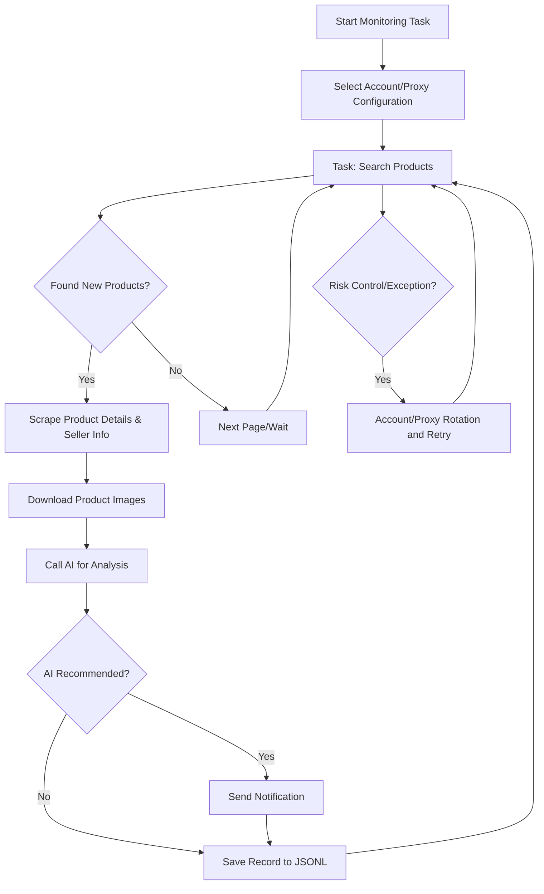

# Xianyu Intelligent Monitor Bot

[中文说明](README.md)

A Playwright and AI-powered multi-task real-time monitoring tool for Xianyu (闲鱼), featuring a complete web management interface.

## Core Features

- **Web Visual Management**: Task management, account management, AI criteria editing, run logs, results browsing
- **AI-Driven**: Natural language task creation, multimodal model for in-depth product analysis
- **Multi-Task Concurrency**: Independent configuration for keywords, prices, filters, and AI prompts
- **Advanced Filtering**: Free shipping, new listing time range, province/city/district filtering
- **Instant Notifications**: Supports ntfy.sh, WeChat Work (企业微信), Bark, Telegram, Webhook
- **Scheduled Tasks**: Cron expression configuration for periodic tasks
- **Account & Proxy Rotation**: Multi-account management, task-account binding, proxy pool rotation with failure retry
- **Docker Deployment**: One-click containerized deployment

## Screenshots


## Quick Start

### Requirements

- Python 3.10+
- Node.js + npm (`Node v20.18.3` has been verified to complete the frontend build)
- Playwright and Chromium dependencies

```bash
git clone https://github.com/Usagi-org/ai-goofish-monitor
cd ai-goofish-monitor
cp .env.example .env
```

### Minimum Configuration

| Variable | Description | Required |
|----------|-------------|----------|
| `OPENAI_API_KEY` | AI model API key | Yes |
| `OPENAI_BASE_URL` | OpenAI-compatible API base URL | Yes |
| `OPENAI_MODEL_NAME` | Model name with image input support | Yes |
| `WEB_USERNAME` / `WEB_PASSWORD` | Web UI login credentials, default `admin/admin123` | No |

See "Configuration" below for the rest.

### Start Locally

```bash
chmod +x start.sh
./start.sh
```

`start.sh` handles dependency checks, installs, frontend build, artifact copy, and backend startup.

### First-Time Setup

1. Open `http://127.0.0.1:8000` and sign in to the Web UI.
2. Go to "Xianyu Account Management" and use the [Chrome Extension](https://chromewebstore.google.com/detail/xianyu-login-state-extrac/eidlpfjiodpigmfcahkmlenhppfklcoa) to export and paste the Xianyu login-state JSON.
3. Login-state files are stored in `state/`, for example `state/acc_1.json`.
4. Go back to "Task Management", create a task, bind an account if needed, and run it.

### Create Your First Task

- `AI mode`: fill in the requirement description. Submission opens a separate progress dialog while the criteria are generated asynchronously.
- `Keyword mode`: provide keyword rules and the task is created immediately.
- `Region filter`: now uses a structured province / city / district selector backed by a built-in snapshot from Goofish, not manual text input.

## 🐳 Docker Deployment

```bash
docker compose up -d
docker compose logs -f app
docker compose down
```

- Web UI: `http://127.0.0.1:8000`
- Update image: `docker compose pull && docker compose up -d`
- `docker-compose.yaml` already persists these paths by default:
  - `state/`
  - `config.json`
  - `prompts/`
  - `jsonl/`
  - `logs/`
  - `images/`

## User Guide

<details>
<summary>Click to expand Web UI usage notes</summary>

### Task Management

- Supports AI creation, keyword rules, price range, new listing filters, region filters, account binding, and cron scheduling.
- AI task creation runs as a background job and shows a dedicated progress dialog after submission.
- Region filtering can greatly reduce results, so leaving it empty is the safer default.

### Account Management

- Import, update, and delete Xianyu login states.
- Each task can bind a specific account or leave account selection to the system.

### Results and Logs

- The results page shows matched items and details.
- The logs page is the first place to inspect login-state expiry, anti-bot issues, or AI call failures.

### System Settings

- View system status, edit prompts, and adjust proxy / rotation-related settings.

</details>

## Developer Guide

### Local Development

```bash
# backend
python -m src.app
# or
uvicorn src.app:app --host 0.0.0.0 --port 8000 --reload

# frontend
cd web-ui
npm install
npm run dev
```

- The Vite dev server proxies `/api`, `/auth`, and `/ws` to `http://127.0.0.1:8000`.
- `npm run build` writes `web-ui/dist/`, and `start.sh` copies it to the repository root `dist/`.
- FastAPI serves `dist/index.html` and `dist/assets/` from the repository root.

### Validation

```bash
PYTEST_DISABLE_PLUGIN_AUTOLOAD=1 pytest
cd web-ui && npm run build
```

### Task Creation API

<details>
<summary>Click to expand API behavior</summary>

- `POST /api/tasks/generate`
  - `decision_mode=ai`: returns `202` with a `job`; the client should poll for progress.
  - `decision_mode=keyword`: returns the created task directly.
- `GET /api/tasks/generate-jobs/{job_id}`: fetch AI task-generation progress.
- `POST /auth/status`: validate Web UI credentials.

</details>

## Configuration

<details>
<summary>Click to expand common configuration items</summary>

### AI and Runtime

- `OPENAI_API_KEY` / `OPENAI_BASE_URL` / `OPENAI_MODEL_NAME`: required AI model settings.
- `PROXY_URL`: dedicated HTTP/SOCKS5 proxy for AI requests.
- `RUN_HEADLESS`: whether the scraper runs headless; keep it `true` in Docker.
- `SERVER_PORT`: backend port, default `8000`.
- `LOGIN_IS_EDGE`: use Edge instead of Chrome for login-state extraction.
- `PCURL_TO_MOBILE`: convert desktop item URLs to mobile URLs.

### Notifications

- `NTFY_TOPIC_URL`
- `GOTIFY_URL` / `GOTIFY_TOKEN`
- `BARK_URL`
- `WX_BOT_URL`
- `TELEGRAM_BOT_TOKEN` / `TELEGRAM_CHAT_ID`
- `WEBHOOK_*`

### Proxy Rotation and Failure Guard

- `PROXY_ROTATION_ENABLED`
- `PROXY_ROTATION_MODE`
- `PROXY_POOL`
- `PROXY_ROTATION_RETRY_LIMIT`
- `PROXY_BLACKLIST_TTL`
- `TASK_FAILURE_THRESHOLD`
- `TASK_FAILURE_PAUSE_SECONDS`
- `TASK_FAILURE_GUARD_PATH`

See `.env.example` for the full list.

</details>

## Web Authentication

<details>
<summary>Click to expand authentication notes</summary>

- The Web UI uses a login page and validates credentials through `POST /auth/status`.
- After login, the frontend stores local auth state for route guards and WebSocket startup.
- The default credentials are `admin/admin123`; change them in production.

</details>

## 🚀 Workflow

The diagram below shows the core processing flow of a monitoring task. The main service runs in `src.app` and launches one or more task processes based on user actions or schedule triggers.


```mermaid
graph TD
    A[Start Monitoring Task] --> B[Select Account/Proxy Configuration];
    B --> C[Task: Search Products];
    C --> D{Found New Products?};
    D -- Yes --> E[Scrape Product Details & Seller Info];
    E --> F[Download Product Images];
    F --> G[Call AI for Analysis];
    G --> H{AI Recommended?};
    H -- Yes --> I[Send Notification];
    H -- No --> J[Save Record to JSONL];
    I --> J;
    D -- No --> K[Next Page/Wait];
    K --> C;
    J --> C;
    C --> L{Risk Control/Exception?};
    L -- Yes --> M[Account/Proxy Rotation and Retry];
    M --> C;
```

## FAQ

<details>
<summary>Click to expand FAQ</summary>

### Why does AI task creation take time?

In AI mode, the system generates analysis criteria before the task itself is created. This now runs as a background job with a separate progress dialog instead of blocking the task form.

### Why is the region filter optional by default?

Region filtering can sharply reduce result volume. Leave it empty if you want a broader market scan first.

### Why does the app say the frontend build artifacts are missing?

It means the repository root `dist/` directory is missing. Run `./start.sh`, or build the frontend in `web-ui/` and make sure the artifacts are copied to the root `dist/`.

</details>

## Acknowledgments

<details>
<summary>Click to expand acknowledgments</summary>

This project referenced the following excellent projects during development. Special thanks to:

- [superboyyy/xianyu_spider](https://github.com/superboyyy/xianyu_spider)

Also thanks to LinuxDo contributors for script contributions:

- [@jooooody](https://linux.do/u/jooooody/summary)

And thanks to the [LinuxDo](https://linux.do/) community.

Also thanks to ClaudeCode/Gemini/Codex and other model tools for freeing our hands and experiencing the joy of Vibe Coding.

</details>

## Reflections

<details>
<summary>Click to expand project reflections</summary>

Over 90% of this project's code was generated by AI, including PRs related to issues.

The scary thing about Vibe Coding is that if you don't participate much in the project development, don't carefully review AI-generated code, don't think about why AI wrote it this way, and blindly verify functionality by running test cases, the project will become a black box.

Similarly, when using AI to review AI-generated code, it's like using AI to verify if another AI's answer is AI-generated, falling into a self-proving dilemma. So AI can assist with analysis, but shouldn't become the arbiter of truth.

</details>

## Notices

<details>
<summary>Click to expand notice details</summary>

- Please comply with Xianyu's user agreement and robots.txt rules. Do not make frequent requests to avoid burdening the server or having your account restricted.
- This project is for learning and technical research purposes only. Do not use it for illegal purposes.
- This project is released under the [MIT License](LICENSE), provided "as is", without any form of warranty.
- The project authors and contributors are not responsible for any direct, indirect, incidental, or special damages or losses caused by the use of this software.
- For more details, please refer to the [Disclaimer](DISCLAIMER.md) file.

</details>

## Star History

[](https://www.star-history.com/#Usagi-org/ai-goofish-monitor&Date)
