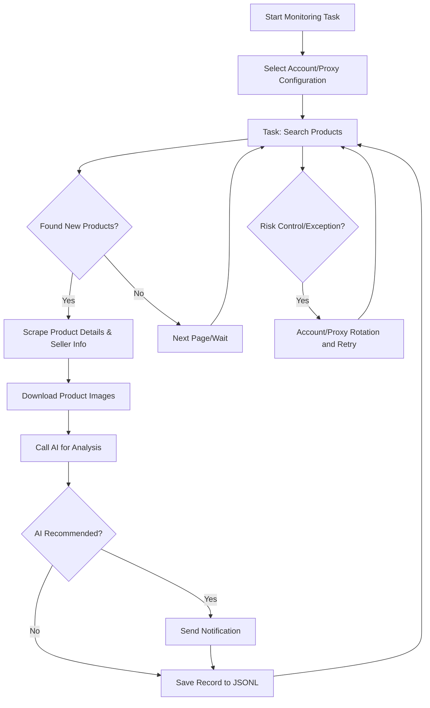

# Xianyu Intelligent Monitor Bot

A Playwright and AI-powered multi-task real-time monitoring tool for Xianyu (闲鱼), featuring a complete web management interface.

## Core Features

- **Web Visual Management**: Task management, account management, AI criteria editing, run logs, results browsing
- **AI-Driven**: Natural language task creation, multimodal model for in-depth product analysis
- **Multi-Task Concurrency**: Independent configuration for keywords, prices, filters, and AI prompts
- **Advanced Filtering**: Free shipping, new listing time range, province/city/district filtering
- **Instant Notifications**: Supports ntfy.sh, WeChat Work (企业微信), Bark, Telegram, Webhook
- **Scheduled Tasks**: Cron expression configuration for periodic tasks
- **Account & Proxy Rotation**: Multi-account management, task-account binding, proxy pool rotation with failure retry
- **Docker Deployment**: One-click containerized deployment

## Screenshots


## Quick Start

### Environment Preparation

**Requirements**:
- Python 3.10+
- Node.js + npm (for frontend build)
- Playwright browser dependencies (run `playwright install chromium` if not installed)

```bash
git clone https://github.com/Usagi-org/ai-goofish-monitor
cd ai-goofish-monitor
```

### Configuration

1. **Create Configuration File**

```bash
cp .env.example .env
```

2. **Core Configuration Items**

| Variable | Description | Required |
|----------|-------------|----------|
| `OPENAI_API_KEY` | AI Model API Key | Yes |
| `OPENAI_BASE_URL` | API endpoint URL (OpenAI compatible) | Yes |
| `OPENAI_MODEL_NAME` | Multimodal model name (e.g., `gpt-4o`) | Yes |
| `WEB_USERNAME` / `WEB_PASSWORD` | Web interface login credentials (default: `admin` / `admin123`) | No |
| `NTFY_TOPIC_URL` | ntfy.sh notification URL | No |
| `BARK_URL` | Bark push URL | No |
| `WX_BOT_URL` | WeChat Work Webhook (wrap with double quotes) | No |

Refer to `.env.example` for complete configuration options.

3. **Start Service**

```bash
chmod +x start.sh && ./start.sh
```

The start.sh script will automatically install dependencies, build frontend, and start the backend.

4. **Access Web UI**
Visit `http://127.0.0.1:8000`, 
**Login with default credentials (admin/admin123)** → **Xianyu Account Management**, follow the prompts to use the [Chrome Extension](https://chromewebstore.google.com/detail/xianyu-login-state-extrac/eidlpfjiodpigmfcahkmlenhppfklcoa) to extract and paste the login state JSON.
Accounts are saved to the `state/` directory (e.g., `state/acc_1.json`). Then bind the account in **Task Management** to start using.

## 🐳 Docker Deployment

Use `docker-compose.yaml` for one-click startup. The image includes pre-built frontend and runtime environment.

### 1) Preparation (Optional, can be configured in UI after startup)

```bash
cp .env.example .env
vim .env
```

### 2) Start

```bash
docker compose up -d
```

### 3) Access and Management

- **Access Web UI**: `http://127.0.0.1:8000`
- **View Logs**: `docker compose logs -f app`
- **Stop Service**: `docker compose down`

Account state is saved in container `/app/state` by default. For persistence, add volume mount `./state:/app/state` in compose file.

### 4) Update Image

```bash
docker compose pull
docker compose up -d
```

## Web UI Features

<details>
<summary>Click to expand Web UI features</summary>

- **Task Management**: AI creation, parameter editing, task scheduling, account binding
- **Xianyu Account Management**: Add/update/delete accounts, import login state JSON
- **Results View**: Card browsing, filtering and sorting, detail viewing
- **Run Logs**: Grouped by task, incremental loading, auto-refresh
- **System Settings**: Status check, Prompt editing, proxy rotation

</details>

## 🚀 Workflow

The diagram below describes the core processing logic of a single monitoring task from start to finish. In practice, `src.app` serves as the main service, launching one or more task processes based on user operations or scheduled triggers.



## Web Interface Authentication

<details>
<summary>Click to expand authentication configuration details</summary>

### Authentication Configuration

The Web interface is protected with Basic authentication, ensuring only authorized users can access the management interface and API.

#### Configuration Method

Set authentication credentials in the `.env` file:

```bash
# Web service authentication configuration
WEB_USERNAME=admin
WEB_PASSWORD=admin123
```

#### Default Credentials

If authentication credentials are not set in the `.env` file, the system will use these defaults:
- Username: `admin`
- Password: `admin123`

**⚠️ Important: Please change the default password in production environments!**

#### Authentication Scope

- **Requires Authentication**: All API endpoints, Web interface, static resources
- **No Authentication Required**: Health check endpoint (`/health`)

#### Usage

1. **Browser Access**: Authentication dialog appears when visiting the Web interface
2. **API Calls**: Include Basic authentication in request headers
3. **Frontend JavaScript**: Automatically handles authentication, no modification needed

#### Security Recommendations

1. Change default password to a strong password
2. Use HTTPS protocol in production environments
3. Regularly rotate authentication credentials
4. Restrict access IP range through firewall

For detailed configuration instructions, refer to [AUTH_README.md](AUTH_README.md).

</details>

## Acknowledgments

<details>
<summary>Click to expand acknowledgments</summary>

This project referenced the following excellent projects during development. Special thanks to:

- [superboyyy/xianyu_spider](https://github.com/superboyyy/xianyu_spider)

Also thanks to LinuxDo contributors for script contributions:

- [@jooooody](https://linux.do/u/jooooody/summary)

And thanks to the [LinuxDo](https://linux.do/) community.

Also thanks to ClaudeCode/Gemini/Codex and other model tools for freeing our hands and experiencing the joy of Vibe Coding.

</details>

## Reflections

<details>
<summary>Click to expand project reflections</summary>

Over 90% of this project's code was generated by AI, including PRs related to issues.

The scary thing about Vibe Coding is that if you don't participate much in the project development, don't carefully review AI-generated code, don't think about why AI wrote it this way, and blindly verify functionality by running test cases, the project will become a black box.

Similarly, when using AI to review AI-generated code, it's like using AI to verify if another AI's answer is AI-generated, falling into a self-proving dilemma. So AI can assist with analysis, but shouldn't become the arbiter of truth.

</details>

## Notices

<details>
<summary>Click to expand notice details</summary>

- Please comply with Xianyu's user agreement and robots.txt rules. Do not make frequent requests to avoid burdening the server or having your account restricted.
- This project is for learning and technical research purposes only. Do not use it for illegal purposes.
- This project is released under the [MIT License](LICENSE), provided "as is", without any form of warranty.
- The project authors and contributors are not responsible for any direct, indirect, incidental, or special damages or losses caused by the use of this software.
- For more details, please refer to the [Disclaimer](DISCLAIMER.md) file.

</details>

## Star History

[](https://www.star-history.com/#Usagi-org/ai-goofish-monitor&Date)